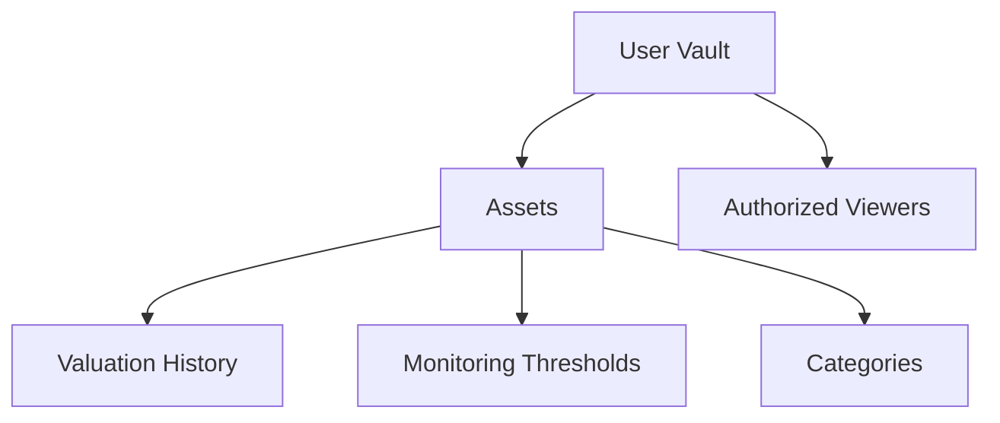

# Mini Validate Database

A secure and transparent blockchain-based system for tracking digital assets with privacy controls, valuation history, and monitoring capabilities.

## Overview

VaultPulse Asset Tracker enables users to:
- Register and categorize digital assets
- Track asset valuations over time
- Set monitoring thresholds for asset values
- Control privacy settings and authorized viewers
- Maintain immutable records for compliance and reporting
- Generate asset performance analytics

## Architecture

The system is built around the concept of user vaults that contain digital assets. Each vault can hold multiple assets, with comprehensive tracking of valuations and customizable monitoring thresholds.



### Core Components:
- **Vaults**: Container for a user's portfolio with privacy settings
- **Assets**: Individual digital assets with metadata and current valuation
- **History**: Immutable record of asset valuations over time
- **Categories**: User-defined asset classifications
- **Thresholds**: Monitoring rules for asset values
- **Access Control**: Granular permissions for vault viewers

## Contract Documentation

### Main Contract: data-validator.clar

The primary contract that manages database validation and record tracking.

#### Key Data Structures:
- `assets`: Stores record details and metadata
- `asset-history`: Tracks record modification history
- `user-categories`: Custom record categorization
- `vaults`: User database metadata
- `authorized-viewers`: Access control for third parties
- `monitoring-thresholds`: Validation rule monitoring

## Getting Started

### Prerequisites
- Clarinet CLI
- Stacks wallet for deployment

### Basic Usage

1. Initialize a database vault:
```clarity
(contract-call? .data-validator set-category "finance" u"Financial Records" (some u"Sensitive financial data management"))
```

2. Register a new record:
```clarity
(contract-call? .data-validator register-asset 
    "record001" 
    u"Customer Financial Profile" 
    "finance" 
    u1635724800 
    u0 
    u1 
    (some u"Compliance-related record") 
    false)
```

3. Update record status:
```clarity
(contract-call? .data-validator update-asset-value "record001" u2)
```

## Function Reference

### Asset Management

#### register-asset
```clarity
(register-asset 
    (asset-id (string-ascii 36))
    (name (string-utf8 100))
    (category (string-ascii 50))
    (acquisition-date uint)
    (acquisition-cost uint)
    (current-value uint)
    (metadata (optional (string-utf8 1000)))
    (public-view bool))
```

#### update-asset-value
```clarity
(update-asset-value (asset-id (string-ascii 36)) (new-value uint))
```

### Access Control

#### authorize-viewer
```clarity
(authorize-viewer (viewer principal) (expiration (optional uint)))
```

#### revoke-viewer
```clarity
(revoke-viewer (viewer principal))
```

### Monitoring

#### set-threshold
```clarity
(set-threshold
    (asset-id (string-ascii 36))
    (threshold-id (string-ascii 36))
    (comparison (string-ascii 2))
    (value uint)
    (description (optional (string-utf8 200))))
```

## Development

### Local Testing

1. Initialize project:
```bash
clarinet new mini-validate-database
```

2. Run tests:
```bash
clarinet test
```

3. Start local chain:
```bash
clarinet console
```

## Security Considerations

### Access Control
- All asset operations require owner authentication
- Viewer access can be time-limited
- Public visibility is configurable per asset

### Data Privacy
- Asset details are only visible to authorized parties
- Historical records are immutable once created
- Metadata can be optionally included or excluded

### Limitations
- No support for fractional ownership
- Asset values must be represented as integers
- Threshold monitoring requires external triggers

### Best Practices
- Regularly review authorized viewers
- Set expiration dates for temporary access
- Keep sensitive details in metadata optional
- Validate all inputs before transactions